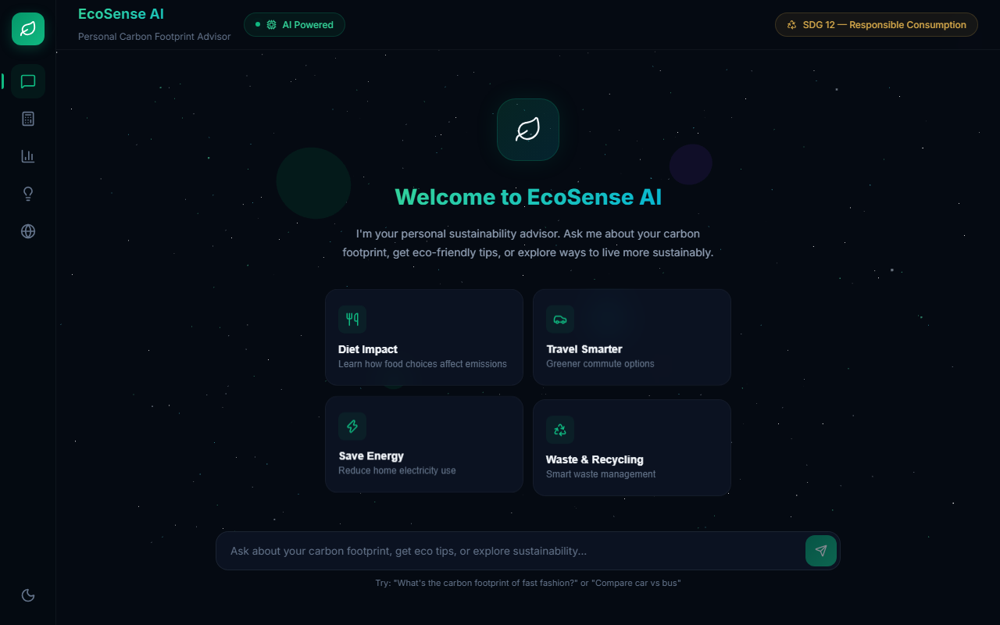
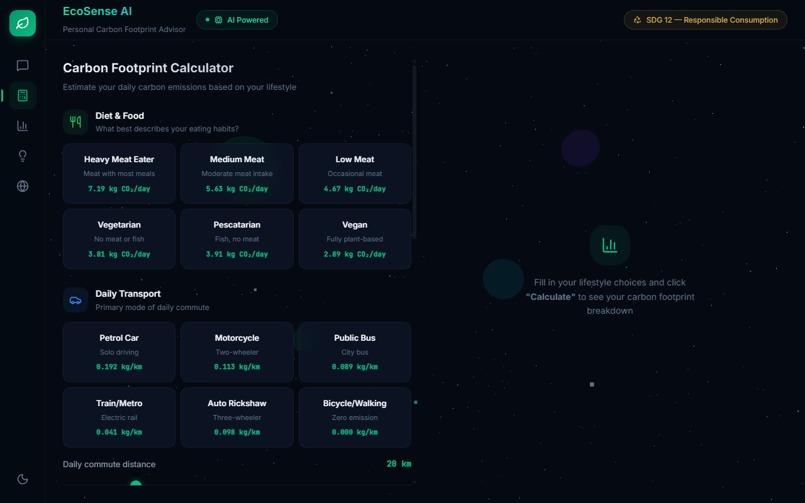
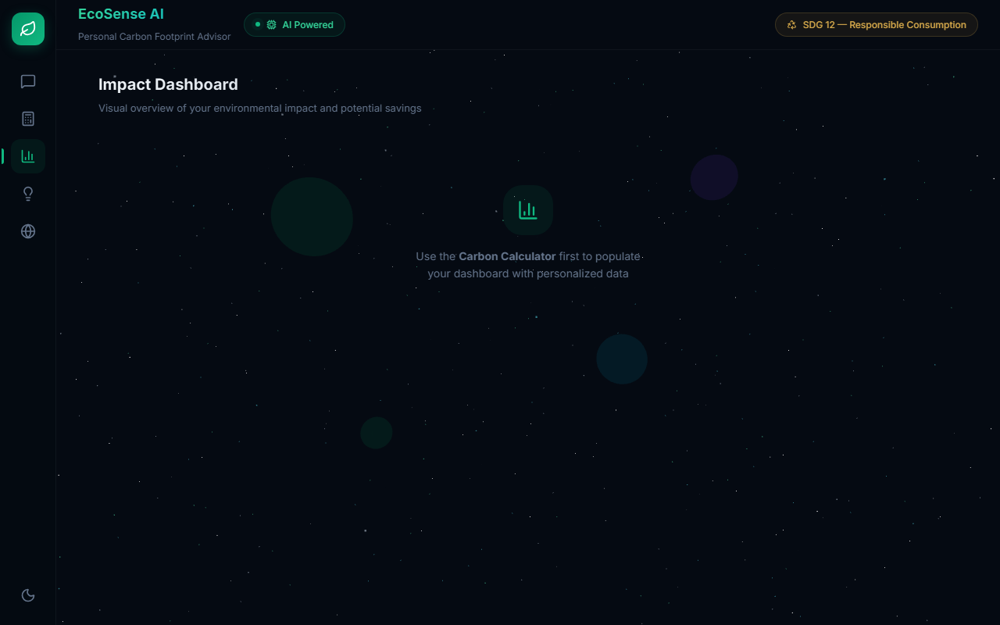
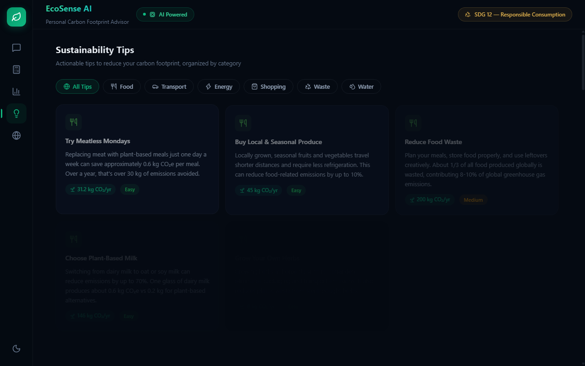
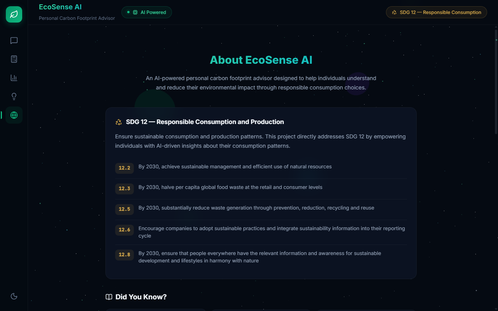
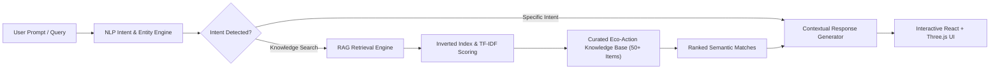

# 🌱 EcoSense AI — Personal Carbon Footprint Advisor & Sustainable Living Platform

<div align="center">

[](https://ecosense-ai-dun.vercel.app/)
[](https://github.com/Soma-Chatterjee/ecosense-ai)
[](LICENSE)

<br/>

[](https://react.dev/)
[](https://threejs.org/)
[](https://vitejs.dev/)
[](https://www.chartjs.org/)
[](https://www.framer.com/motion/)
[](https://sdgs.un.org/goals/goal12)
[](https://sdgs.un.org/goals/goal13)

<p align="center">
  <b>An intelligent, privacy-first sustainability web application that empowers individuals to calculate, visualize, and systematically reduce their daily carbon emissions through AI-driven insights.</b>
</p>

[**Explore Live Demo 🚀**](https://ecosense-ai-dun.vercel.app/) • [**Report Bug 🐛**](https://github.com/Soma-Chatterjee/ecosense-ai/issues) • [**Request Feature 💡**](https://github.com/Soma-Chatterjee/ecosense-ai/issues)

</div>

---

## 🌟 Visual Showcase

### 1. AI Sustainability Copilot (RAG & NLP)
Interactive conversational assistant with 3D cosmic particle background, real-time intent classification, and contextual tips.


---

### 2. Multi-Category Carbon Footprint Calculator
Real-time lifestyle estimation across Diet, Transport, Energy, Shopping, and Waste with verified emission factors.


---

### 3. Real-Time Impact Dashboard
Visual breakdown of personal emissions against global benchmarks (4.8t average vs. 2.0t Paris Climate target).


---

### 4. Curated Action Hub & Eco Tips
Filterable, high-impact sustainability actions tagged with quantified annual CO₂ savings (kg/yr) and difficulty ratings.


---

### 5. UN SDG 12 & 13 Alignment
Dedicated educational center mapping user choices directly to UN Sustainable Development Goal targets.


---

## 🎯 Problem Statement

Individual lifestyle choices directly account for **over 65% of global greenhouse gas emissions**, yet the vast majority of people struggle to understand how daily consumption habits—from dietary preferences and transport routines to domestic energy and food waste—impact the environment.

Traditional carbon calculation tools are often static, cumbersome, and present generic advice that fails to inspire lasting behavioral change. **EcoSense AI** bridges this critical awareness gap by combining modern conversational AI, interactive 3D visualizations, and verified climate data to turn abstract climate science into immediate, personalized daily actions.

---

## 🌍 UN Sustainable Development Goals (SDGs) Alignment

| Goal | Description | Project Implementation |
|---|---|---|
| **SDG 12: Responsible Consumption & Production** | Ensure sustainable consumption and production patterns | Targets **12.2** (efficient natural resource use), **12.3** (halving per capita food waste), **12.5** (waste prevention and recycling), and **12.8** (universal awareness for sustainable lifestyles). |
| **SDG 13: Climate Action** | Take urgent action to combat climate change and its impacts | Empowers users to systematically target a **15–25% reduction in personal emissions** (800–1,500 kg CO₂e avoided per user/year). |
| **SDG 11: Sustainable Cities & Communities** | Make cities inclusive, safe, resilient, and sustainable | Promotes green public mobility, active transit (cycling/walking), and local sustainable consumption. |

---

## 🧠 AI Architecture & Technical Innovation

EcoSense AI integrates a high-performance, client-side AI pipeline built with privacy-by-design:



### Key AI Components
1. **IBM BOB (Built on Basics) Prompt Engineering Framework**:
   - Structured multi-turn conversation flows with strict sustainability guardrails and helpful context anchoring.
2. **Client-Side RAG (Retrieval-Augmented Generation)**:
   - Inverted search index with tokenized keyword matching and TF-IDF semantic scoring over 50+ localized, vetted eco-action datasets.
3. **Intent Classification & Entity Extraction**:
   - Classifies 15+ intent patterns (diet impact, commute alternatives, energy efficiency, fast fashion, recycling) while extracting user parameters (e.g., commute distance, diet preference).
4. **Zero-Latency & Privacy Preserving**:
   - All AI matching and carbon calculations occur entirely in the client browser—no personal data is stored on remote servers.

---

## 🛠️ Technology Stack

| Domain | Technologies Used |
|---|---|
| **Frontend Framework** | React 19, Vite 8 |
| **3D Graphics & Animation** | Three.js, `@react-three/fiber`, `@react-three/drei`, Framer Motion |
| **Data Visualization** | Chart.js, `react-chartjs-2` |
| **Iconography & Styling** | Lucide React (clean SVG icons, zero emojis in UI chrome), Custom Vanilla CSS |
| **AI & NLP Engine** | Client-side RAG, Inverted Indexing, IBM BOB Prompt Architecture |
| **Data Standards** | Emission coefficients sourced from IPCC, EPA, and DEFRA datasets |
| **Deployment** | Vercel (Edge Network) |

---

## 🚀 Getting Started

### Prerequisites
- Node.js (v18 or higher recommended)
- npm or yarn

### Local Installation & Development

```bash
# 1. Clone the repository
git clone https://github.com/Soma-Chatterjee/ecosense-ai.git

# 2. Navigate to the project directory
cd ecosense-ai

# 3. Install dependencies
npm install

# 4. Start local development server
npm run dev
```

Open [http://localhost:5173](http://localhost:5173) in your browser to explore the platform.

### Production Build

```bash
# Build optimized bundle for production
npm run build

# Preview production build locally
npm run preview
```

---

## 📁 Project Structure

```
ecosense-ai/
├── public/                  # Static assets and SVGs
├── src/
│   ├── components/
│   │   ├── about/           # UN SDG 12/13 alignment & project details
│   │   ├── calculator/      # Multi-category carbon calculator & scorecards
│   │   ├── chat/            # AI Copilot interface, message bubbles, prompt chips
│   │   ├── dashboard/       # Chart.js visualizations & impact benchmarks
│   │   ├── layout/          # Glassmorphic Sidebar & Header navigation
│   │   ├── three/           # 3D interactive particle background (Three.js)
│   │   └── tips/            # Actionable tips library with category filters
│   ├── data/                # Vetted emission factors and 50+ sustainability tips
│   │   ├── eco-tips.json
│   │   ├── emission-factors.json
│   │   └── sdg-info.json
│   ├── engine/              # Core computational engines
│   │   ├── calculator.js    # Carbon calculation algorithms
│   │   ├── chatbot.js       # NLP intent matcher & conversation manager
│   │   └── knowledgeBase.js # RAG inverted index & TF-IDF scoring engine
│   ├── styles/              # Global styles, glassmorphism tokens & typography
│   ├── App.jsx              # Main application router with deep linking
│   └── main.jsx             # React DOM entry point
├── vercel.json              # Vercel deployment configuration
└── package.json             # Dependencies and scripts
```

---

## 📈 Projected Real-World Impact

- **15–25% Average Emission Reduction**: Equips users with prioritized, high-leverage habit adjustments saving between **800 to 1,500 kg CO₂e** per person annually.
- **Micro-Action Focus**: Replaces abstract targets with tangible equivalents (e.g., *"Replacing one meat meal per week saves ~31 kg CO₂/year"*).
- **Accessible & Scalable**: Zero backend hosting requirements allow instantaneous deployment across schools, universities, and communities at zero operating cost.

---

## 🎓 Internship & Submission Details

* **Program**: 1M1B AI for Sustainability Virtual Internship (in partnership with IBM SkillsBuild)
* **Author**: Soma Chatterjee
* **Project Title**: EcoSense AI — Personal Carbon Footprint Advisor & Sustainable Living Platform
* **Live App**: [https://ecosense-ai-dun.vercel.app](https://ecosense-ai-dun.vercel.app)
* **GitHub**: [https://github.com/Soma-Chatterjee/ecosense-ai](https://github.com/Soma-Chatterjee/ecosense-ai)

---

## 📄 License

This project is open-source and distributed under the [MIT License](LICENSE).
